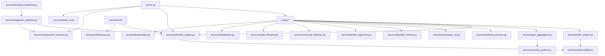

# ARCHITECTURE.md — Project Oracle / Confluence Decoder

## Overview

Project Oracle is a real-time options microstructure analytics engine built on four
core pillars. It ingests live market data, computes microstructure metrics in
real-time, and exposes results through FastAPI routes, a React dashboard, and an
embedded Dash UI.

## The Four Pillars

### 1. No-Polling WebSocket Ingestion
All market data enters via persistent WebSocket connections (`schwab_streamer.py`,
`websocket_streamer.py`). There are no polling loops. Data flows through
`ingestion_pipeline.py` which normalizes feeds from Schwab, Databento, and
yfinance into a unified tick format before writing to DuckDB.

### 2. DuckDB OLAP Engine
`duckdb_engine.py` provides a columnar analytical store for tick data, options
chains, and computed features. All services read from and write to DuckDB via
async batch writes. DuckDB handles time-series aggregation, window queries, and
joins that would be expensive in MongoDB.

### 3. Numba JIT Compilation
Computationally intensive calculations (GEX surfaces, Greeks, VPIN classification)
are JIT-compiled via Numba (`numba_greeks.py`, `gex_aggregator.py`). This brings
C-level performance to numerical Python without leaving the codebase.

### 4. Asyncio Batching
All I/O-bound operations use `asyncio` with batching. The ingestion pipeline
accumulates ticks and flushes in batches. The DuckDB writer uses a bounded queue
with backpressure. Route handlers are fully async.

## Data Flow

```
Schwab Stream  ──┐
Databento Feed ──┼──→ ingestion_pipeline.py ──→ DuckDB (ticks, chains)
yfinance API  ───┘                                      │
                                                        ▼
                                              ┌─── services/*
                                              │
                    ┌─────────────────────────┼──────────────────────┐
                    │                         │                      │
                    ▼                         ▼                      ▼
            vpin_engine.py          gex_aggregator.py      hawkes_process.py
            anomaly_detector.py     trinity_alignment.py   stochastic_vol.py
            liquidity_metrics.py    node_lifecycle.py      flowseeker.py
                                              │
                                              ▼
                                        routes/*
                                              │
                         ┌────────────────────┼────────────────────┐
                         ▼                    ▼                    ▼
                   FastAPI REST          WebSocket /ws/*      Dash UI /dashboard/
                         │                                         │
                         ▼                                         ▼
                   React Frontend                        Embedded Plotly charts
```

## Service Taxonomy

### Phase 1 — Ingestion & Storage
| Service | File | Purpose |
|---------|------|---------|
| Ingestion Pipeline | `ingestion_pipeline.py` | Normalize and route market data |
| DuckDB Engine | `duckdb_engine.py` | Columnar OLAP storage |
| WebSocket Streamer | `websocket_streamer.py` | Persistent WS connections |
| Schwab Streamer | `schwab_streamer.py` | Schwab-specific feed handler |

### Phase 2 — Microstructure Analytics
| Service | File | Purpose |
|---------|------|---------|
| VPIN Engine | `vpin_engine.py` | Flow toxicity (Easley et al. 2012) |
| Hawkes Process | `hawkes_process.py` | Self-exciting point processes |
| SABR Model | `stochastic_vol.py` | Stochastic vol surface (Hagan et al. 2002) |
| SVI Model | `stochastic_vol.py` | Implied vol parameterization (Gatheral 2004) |
| Vol Surface Constructor | `stochastic_vol.py` | Full IV surface builder |
| Kyle Lambda | `liquidity_metrics.py` | Price impact (Kyle 1985) |
| Amihud Illiquidity | `liquidity_metrics.py` | Illiquidity ratio (Amihud 2002) |
| Market Fragility Index | `liquidity_metrics.py` | Composite fragility score |

### Phase 3 — GEX & Options Analytics
| Service | File | Purpose |
|---------|------|---------|
| GEX Aggregator | `gex_aggregator.py` | Gamma/Vomma exposure surfaces |
| GEX History | `gex_history.py` | Historical GEX analysis |
| Node Lifecycle | `node_lifecycle.py` | King Node state machine |
| Trinity Alignment | `trinity_alignment.py` | SPX/SPY/QQQ ZG confluence |
| Flowseeker | `flowseeker.py` | Options flow analysis |
| Heatseeker | `heatseeker.py` | Flip zones, stacked nodes, tug-of-war |

### Phase 4 — Anomaly Detection & ML
| Service | File | Purpose |
|---------|------|---------|
| Anomaly Detector | `anomaly_detector.py` | 1D-CNN autoencoder + statistical fallback |
| ML Features | `ml/features.py` | Feature engineering |
| ML Gate | `ml/gate.py` | Model quality gates |
| ML Registry | `ml/registry.py` | Model versioning |
| ML Quality | `ml/quality.py` | Model evaluation metrics |
| ML Training | `ml_training.py` | Training pipeline |

### Phase 5 — Intelligence & Reporting
| Service | File | Purpose |
|---------|------|---------|
| LLM | `llm.py` | AI-powered analysis |
| Briefing | `briefing.py` | Morning briefing generation |
| Social Flow | `social_flow_pipeline.py` | Social sentiment pipeline |
| UOA | `uoa.py` | Unusual options activity |

## Module Dependency Graph



## Operating Laws

1. **No synthetic data in production.** All models train on real market data only.
   Synthetic data is for testing only.

2. **Truth-audit gated.** Every model must pass the truth audit (11 checks) before
   promotion. See `qc/audit/truth_audit.sh`.

3. **Model quarantine.** Models that fail audit rules are quarantined — not deleted,
   but excluded from live inference. Quarantined: SPY/TLT/IWM v1.0.

4. **Decimal for money.** All monetary calculations use `Decimal`, not `float`.
   (Exception: internal microstructure math where float64 precision is acceptable.)

5. **Structured logging.** All services use `structlog` with JSON output in production.

6. **No polling.** All data ingestion is event-driven via WebSockets or async HTTP.

7. **Rate limiting.** API routes enforce 60 req/min per IP (bypassed in TESTING mode).

8. **Graceful degradation.** If MongoDB is unavailable, the system continues with
   DuckDB-only mode. If PyTorch is unavailable, the anomaly detector falls back to
   statistical z-score detection.
