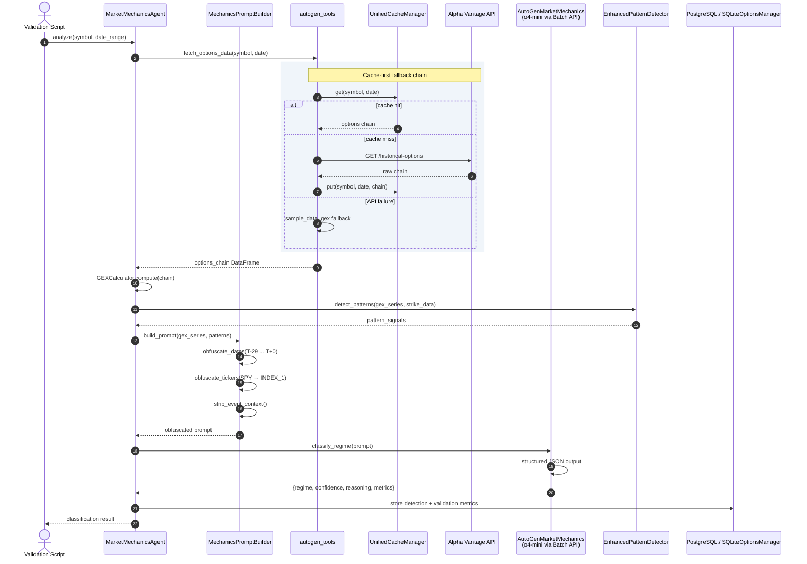

# AutoGen Agent Flow

End-to-end message flow through the `MarketMechanicsAgent` for a single regime-detection request. Agent source: [src/agents/market_mechanics_agent.py](../../../src/agents/market_mechanics_agent.py). Tools: [src/tools/autogen_tools.py](../../../src/tools/autogen_tools.py).

## Flow stages

| # | Stage | Key class / method |
|---|-------|-------------------|
| 1 | Agent init | `MarketMechanicsAgent.__init__` |
| 2 | Data fetch | `fetch_options_data` from [src/tools/autogen_tools.py](../../../src/tools/autogen_tools.py) |
| 3 | GEX calculation | `GEXCalculator.compute` |
| 4 | Pattern detection | `EnhancedPatternDetector.detect_patterns` |
| 5 | Prompt construction | `MechanicsPromptBuilder` — [src/llm/mechanics_prompt_builder.py](../../../src/llm/mechanics_prompt_builder.py) |
| 6 | Obfuscation | Date → `Day T±N`, ticker → `INDEX_1`, events stripped |
| 7 | LLM call | `AutoGenMarketMechanics` — [src/llm/autogen_market_mechanics.py](../../../src/llm/autogen_market_mechanics.py), o4-mini via Batch API, structured JSON |
| 8 | Persistence | `PostgreSQLOptionsManager` or `SQLiteOptionsManager` |

## Design notes

- **Obfuscation is in-line, not post-hoc.** Dates and tickers are stripped before the prompt ever reaches the model, so the LLM never sees identifiable context.
- **Fallback chain is cache → API → sample data.** Sample data comes from `sample_data_gex` and is only invoked if both cache and live API fail — used primarily for offline development.
- **Tool calls are AutoGen-registered.** `fetch_options_data`, `fetch_market_data`, and `calculate_gamma_exposure` are callable by the agent as tools, not hard-coded procedure calls.
- **No multi-turn agent loop** for regime detection — one request, one response. Multi-turn was used in earlier experiments but removed for reproducibility.
