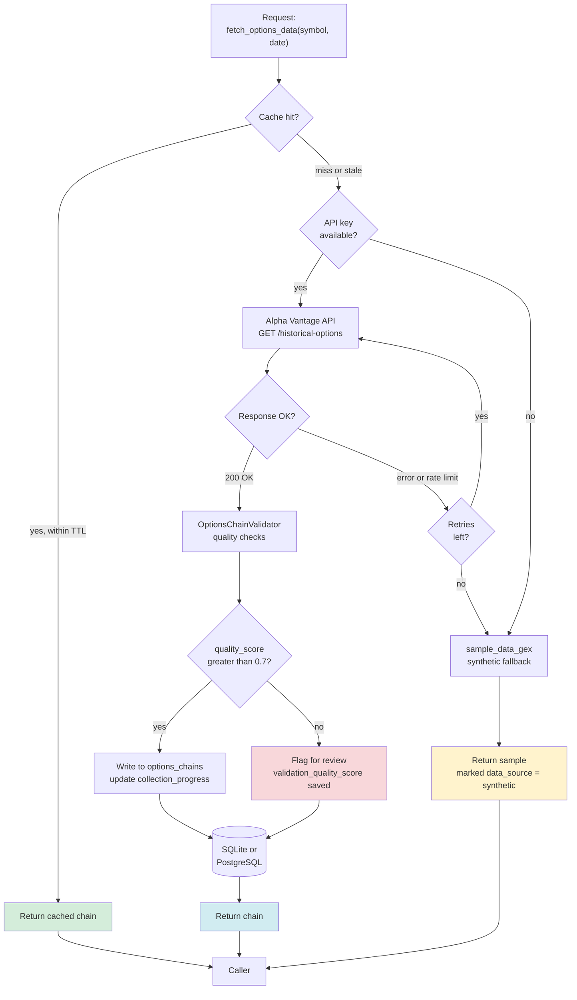

# Cache Layer

Cache-first fallback chain for options data retrieval. Primary source: [src/tools/autogen_tools.py](../../../src/tools/autogen_tools.py) (fetch functions) and [src/cache/research_cache.py](../../../src/cache/research_cache.py) (research cache).

## Cache tiers

The system has two cache abstractions serving different roles:

| Cache | Purpose | Location | TTL |
|-------|---------|----------|-----|
| `UnifiedCacheManager` | Operational — per-request chain fetching for the agent | `.cache/` (local filesystem + DB) | Per request type |
| `ResearchCache` | Experimental — LLM detections, validation results, obfuscation mappings | `.cache/research.db` | None — results are permanent |

## Fallback chain (ordered)

1. **Cache hit (preferred).** Within TTL, returns immediately — no API call, no network.
2. **Alpha Vantage API.** Live fetch. Validated via `OptionsChainValidator` (Issue #16) before persistence. Quality score ≥0.7 is the threshold for regular storage; below that, the record is flagged but still saved for audit.
3. **Retry with backoff.** Rate-limit (429) and 5xx errors retry with exponential backoff. Permanent failures fall through to sample data.
4. **Sample data (last resort).** `sample_data_gex` returns synthetic options chains with `data_source='synthetic'` — used for offline development and CI, never for published results.

## Invalidation logic

- **By date.** Chain data for past trading days is considered immutable once validated — never invalidated.
- **By key change.** When a schema migration adds columns (e.g., `asset_class`, `validation_quality_score`), old cache entries are preserved and the new columns are nullable with defaults. See [`_migrate_schema`](../../../src/cache/sqlite_options_manager.py).
- **By quality score.** A record with `validation_quality_score < 0.5` can be re-fetched on the next request via the `--force-refresh` flag in collection scripts.
- **Manual reset.** Cache can be wiped per symbol via `UnifiedCacheManager.clear(symbol=X)`.

## Cross-worktree behavior

When running research across multiple git worktrees (see [docs/development/worktree_cache_management.md](../../development/worktree_cache_management.md)), three strategies are supported:

- **Symlink** (recommended for read-only): shared `.cache/` across worktrees
- **Independent caches**: safe for concurrent data collection
- **Rsync patterns**: selective sync, bootstrapping new worktrees

## Scale note

As of Paper 2 data collection: 45.3M+ options contract records, 18.79 GB SQLite database. Full collection took ~14 days sequential via Alpha Vantage Premium API (600 calls/minute limit). Cache hit rate on re-runs approaches 100% for past dates.
