# Data Pipeline — End to End

Full research pipeline from market data ingestion through LLM classification to published results.

```mermaid
flowchart LR
    subgraph Ingestion[1. Ingestion]
        AV[Alpha Vantage<br/>Premium API]
        AV --> Collect[alpha_vantage_gex.py<br/>scripts/data_collection/]
        Collect --> Validate[OptionsChainValidator<br/>Issue #16]
    end

    subgraph Storage[2. Storage]
        Validate --> DB[(options_chains<br/>options_daily_summary<br/>collection_progress)]
        DB -.->|18.79 GB<br/>45.3M+ rows| Size[ ]
    end

    subgraph Compute[3. GEX Computation]
        DB --> GEXCalc[GEXCalculator<br/>src/gex/gex_calculator.py]
        GEXCalc --> Summary[options_daily_summary<br/>total_gex, regime, flip level]
    end

    subgraph Window[4. Windowing]
        Summary --> Roll[30-day rolling windows<br/>scripts/validation/paper2/]
        Roll --> NegCtl[Negative controls:<br/>shuffle, transitional,<br/>low-magnitude]
    end

    subgraph Obf[5. Obfuscation]
        Roll --> Obfuscate[MechanicsPromptBuilder<br/>Date → T+N<br/>SPY → INDEX_1<br/>strip context]
        NegCtl --> Obfuscate
    end

    subgraph LLM_[6. LLM Classification]
        Obfuscate --> Prompt[Structured prompt<br/>criteria + sequence + JSON schema]
        Prompt --> OpenAI[OpenAI Batch API<br/>o4-mini]
        OpenAI --> Parse[JSON response:<br/>regime, confidence,<br/>reasoning, metrics]
    end

    subgraph Validation[7. Validation]
        Parse --> Check[Metric verification<br/>LLM output vs ground truth]
        Check --> Store2[(research_cache.db<br/>llm_detections<br/>validation_results<br/>experiment_runs)]
    end

    subgraph Output[8. Outputs]
        Store2 --> Figures[Paper figures<br/>docs/papers/*/figures/]
        Store2 --> Tables[Results tables<br/>reports/]
        Store2 --> Analysis[Statistical analysis<br/>phi, p-values, sample sizes]
        Figures --> Papers[LaTeX papers<br/>IEEE, JRFM, AIAI]
        Tables --> Papers
        Analysis --> Papers
    end

    style Ingestion fill:#e8f4f8
    style Storage fill:#fff4e6
    style Compute fill:#f0f4e8
    style Window fill:#e8f8f4
    style Obf fill:#f8e8f0
    style LLM_ fill:#f0e8f8
    style Validation fill:#e8e8f8
    style Output fill:#f8f8e8
```

## Stage detail

| Stage | Owner | Output |
|-------|-------|--------|
| 1. Ingestion | `scripts/data_collection/alpha_vantage_gex.py` | Raw options chains (validated) |
| 2. Storage | `SQLiteOptionsManager` / `PostgreSQLOptionsManager` | Persistent relational store |
| 3. GEX computation | `GEXCalculator` | Scalar GEX metrics per day |
| 4. Windowing | `scripts/validation/paper2/` | 30-day rolling windows + negative controls |
| 5. Obfuscation | `MechanicsPromptBuilder` | Context-stripped sequences |
| 6. LLM classification | `AutoGenMarketMechanics` via OpenAI Batch API | Structured JSON regime classifications |
| 7. Validation | `validation_results` table | Metric-accuracy + confidence-correlation scores |
| 8. Outputs | Paper-specific figure scripts, LaTeX sources | Published figures, tables, manuscripts |

## Published scale (Paper 2)

| Quantity | Value |
|----------|-------|
| Trading days covered | 2020–2025 (6 years) |
| Real 30-day windows | 1,412 |
| Synthetic negative controls | 809 |
| Total LLM evaluations | 2,221 |
| Total LLM cost | ~$11.07 |
| Batch API completion rate | 100% |
| Manual review sample | 50 windows — 98% mechanical accuracy |

## Reproducibility

Every stage is deterministic given:

1. **Input**: raw options chains (stored, immutable for past dates)
2. **Code**: pinned `src/` at the commit tagged for each paper
3. **Config**: YAML files under `config_defaults/`
4. **Obfuscation mappings**: persisted in `obfuscation_mappings` table, enabling recovery of real dates for analysis while keeping the LLM-facing inputs anonymous

Re-running the full Paper 2 validation on cached data (no new API calls) takes under 4 hours end-to-end.
