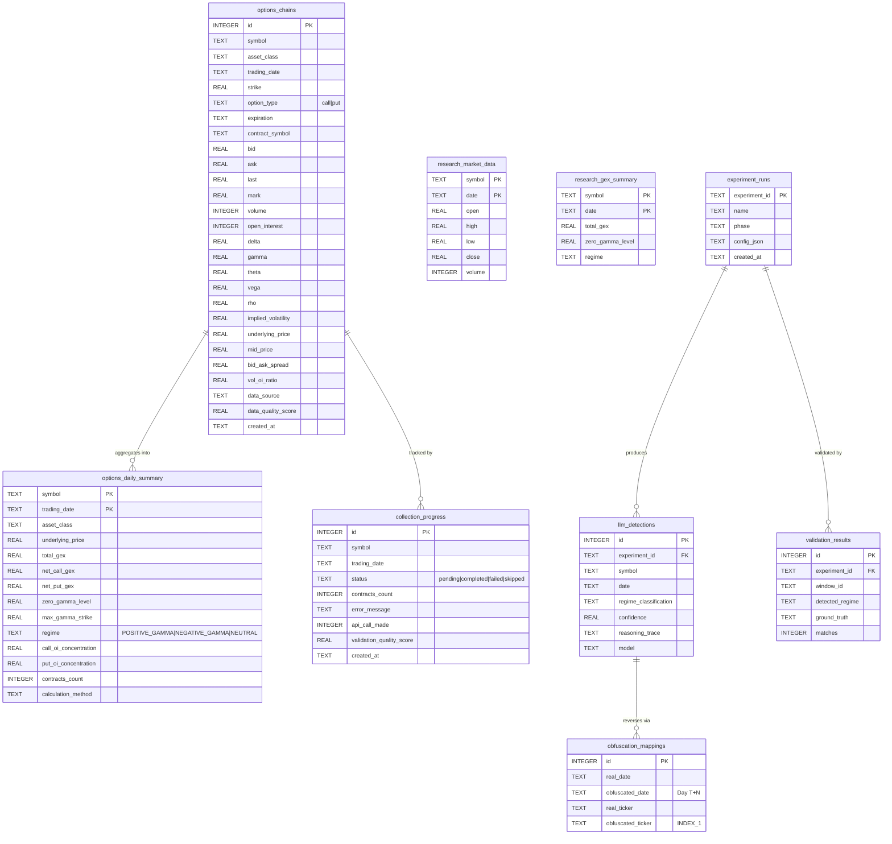

# SQLite Schema — Options Data

Persistent storage for options-chain data, daily GEX summaries, and collection progress. Source of truth: [src/cache/sqlite_options_manager.py](../../../src/cache/sqlite_options_manager.py).

A second database, the research cache ([src/cache/research_cache.py](../../../src/cache/research_cache.py)), stores LLM outputs, validation results, and obfuscation mappings separately from the raw chain store.

## Notes

- **Two-database design.** `options_chains` / `options_daily_summary` / `collection_progress` live in the primary chain DB (paths configured per collection script). LLM outputs, validation results, and obfuscation mappings live in the research cache, so academic results can be reproduced without the 18+ GB raw chain data.
- **Uniqueness constraint** on `options_chains`: `(symbol, trading_date, strike, option_type, expiration)` — supports idempotent backfills.
- **Migration-safe columns.** `asset_class` (multi-asset support) and `validation_quality_score` (Issue #16) were added via `ALTER TABLE` in [`_migrate_schema`](../../../src/cache/sqlite_options_manager.py) rather than DB re-creation.
- **Indexes** exist on `(symbol, trading_date)`, `(symbol, trading_date, strike)`, `(symbol, trading_date, gamma, delta)`, and `expiration` for strike-level scans.
- **PostgreSQL alternative.** The active agent code path uses `PostgreSQLOptionsManager` from the `gex_db_infrastructure` package; `sqlite_options_manager.py` is the local/research path with an identical schema.
