# LLM Integration

Single-request flow from raw GEX series to structured classification output. Source: [src/llm/autogen_market_mechanics.py](../../../src/llm/autogen_market_mechanics.py) + [src/llm/mechanics_prompt_builder.py](../../../src/llm/mechanics_prompt_builder.py).

```mermaid
flowchart TD
    Raw[Raw 30-day GEX series<br/>SPY, 2024-03-15 to 2024-04-12<br/>Net GEX values, strike data]

    subgraph Obfuscate[Obfuscation Layer]
        Dates[Dates → Day T-29 ... Day T+0]
        Tickers[SPY → INDEX_1]
        Events[Strip FOMC / earnings / VIX context]
        Weekdays[Strip day-of-week, OpEx markers]
    end

    Raw --> Obfuscate

    subgraph Prompt[Prompt Construction - MechanicsPromptBuilder]
        System["System: 'financial market analyst identifying<br/>persistent dealer gamma regimes'"]
        Criteria["Classification criteria:<br/>Persistence ≥ 0.70<br/>Magnitude ≥ dollar 5B<br/>Stability ≤ 5 flips"]
        Sequence[Obfuscated 30-day sequence]
        Schema[JSON output schema]
    end

    Obfuscate --> Prompt

    subgraph API[OpenAI Batch API Call]
        Model[model = o4-mini]
        Config["temperature = 1.0<br/>max_tokens = 16,384<br/>response_format = JSON"]
        Batch[Batch async submission<br/>100 percent completion rate]
    end

    Prompt --> API

    API --> Response

    subgraph Response[Structured JSON Response]
        Regime["regime_type:<br/>persistent_positive<br/>persistent_negative<br/>transitional<br/>low_conviction"]
        Confidence["confidence: 0 - 100"]
        Reasoning[reasoning_trace: step-by-step]
        Metrics[computed metrics: persistence, magnitude, flips]
    end

    Response --> Validate

    subgraph Validate[Validation]
        Metric[Metric accuracy check<br/>LLM vs ground truth<br/>flag discrepancy greater than 5 percent]
        QA[50-window manual review sampling<br/>98 percent mechanical accuracy<br/>88 percent step-by-step verification]
    end

    Validate --> Store[(Research cache:<br/>llm_detections<br/>validation_results)]

    style Obfuscate fill:#e8f4f8
    style Prompt fill:#fff4e6
    style API fill:#f0f4e8
    style Response fill:#f8e8f0
    style Validate fill:#e8e8f8
```

## Stage-by-stage

**1. Obfuscation (pre-prompt).**
Real calendar dates collapse to offsets from the target day (`Day T-29` through `Day T+0`). Ticker symbols become generic identifiers (`INDEX_1`). Event context (`Fed meeting`, `earnings`, `OpEx`, specific VIX values) is stripped. Day-of-week and weekday patterns removed. Mapping is stored in the `obfuscation_mappings` table so real results can be recovered for analysis.

**2. Prompt construction.**
`MechanicsPromptBuilder` assembles four elements in order:

- **System message** — role and task scope
- **Classification criteria** — explicit thresholds, preventing the model from inventing cutoffs
- **Obfuscated sequence** — the 30-day GEX values, spot prices, flip levels
- **JSON schema** — required response format with regime, confidence, reasoning, and computed metrics

**3. API call.**
Model is `o4-mini` (OpenAI reasoning family). Batch API is used for all Paper 2 experiments — asynchronous submission, 100% completion rate across 2,221 evaluations, structured JSON output enforced via `response_format`. Temperature=1.0 is intentional for reasoning models.

**4. Response parsing.**
The model returns a strict JSON object containing:
- `regime_type` — one of four enum values
- `confidence` — integer 0–100
- `reasoning_trace` — free-text explanation
- `computed_metrics` — LLM's own persistence / magnitude / flip count (used to verify mechanical reasoning)

**5. Validation.**
Extracted LLM metrics are compared against ground truth computed from the raw GEX series. Windows with >5% metric discrepancy are flagged for manual review. Confidence scores correlate with regime quality (r = +0.501 with persistence, r = −0.549 with stability).

## Key design decisions

- **Classification criteria in the prompt.** The model is given the thresholds explicitly. This is intentional — obfuscation tests whether the model can *apply* structural criteria under data contamination, not whether it can *invent* them. The 98% mechanical accuracy confirms criterion execution; the 69.1pp separation between 2020 and 2024 confirms the signal itself is structural, not memorized.
- **No chain-of-thought coercion.** Reasoning traces emerge from the JSON schema requirement but are not forced by CoT prompting.
- **Single model, single call.** No ensemble, no self-consistency sampling. Budget discipline — total cost across all 2,221 Paper 2 evaluations was ~$11.07.
