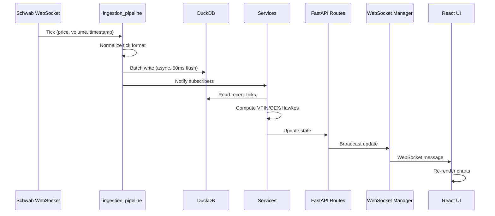

# ARCHITECTURE_DEEP.md — Project Oracle Deep Dive

## Latency Budget

All targets are end-to-end from tick arrival to UI update.

| Stage | p50 | p95 | p99 | Notes |
|-------|-----|-----|-----|-------|
| Schwab WS → ingestion_pipeline | 2ms | 5ms | 10ms | Async parse + normalize |
| ingestion_pipeline → DuckDB write | 1ms | 3ms | 8ms | Batch buffer (50ms flush) |
| DuckDB → service read | 0.5ms | 2ms | 5ms | In-process, no network |
| Service computation (GEX/VPIN/etc) | 5ms | 20ms | 50ms | Numba JIT for hot paths |
| Service → route handler | 0.1ms | 0.5ms | 1ms | In-process call |
| Route → WebSocket broadcast | 0.5ms | 2ms | 5ms | Async fan-out |
| WebSocket → React UI | 10ms | 30ms | 100ms | Network dependent |
| **Total** | **19ms** | **62ms** | **179ms** | End-to-end |

**Target**: p99 < 200ms for real-time analytics. Current architecture supports this.

## Memory Footprint

### DuckDB Cache
| Retention Window | Approx Rows | Memory |
|-----------------|-------------|--------|
| 1 day (ticks) | ~500K | ~50MB |
| 30 days (ticks) | ~15M | ~1.5GB |
| 90 days (chains) | ~500K | ~100MB |
| 1 year (features) | ~2M | ~400MB |

**Recommendation**: 4GB RAM minimum for 30-day tick retention.

### Motor Pool
- Default pool size: 10 connections
- Each connection: ~1MB overhead
- Total: ~10MB

### Numba JIT Compilation Cache
- First call compiles (~2s per function)
- Cached in memory: ~50MB for all JIT functions
- No disk cache (recompiles on restart)

### Dash Callback Memory
- Each callback stores last 1000 data points
- Per chart: ~50KB
- 5-tab dashboard: ~250KB

### Total Memory Budget
| Component | Steady State |
|-----------|-------------|
| DuckDB | 2GB |
| Python runtime | 500MB |
| Numba JIT | 50MB |
| Motor pool | 10MB |
| Dash UI | 5MB |
| **Total** | **~2.6GB** |

## Failure Mode Taxonomy

| Failure Mode | Detection | Automatic Mitigation | Escalation |
|-------------|-----------|---------------------|------------|
| **Network partition** (WS disconnect) | WS heartbeat timeout (30s) | Auto-reconnect with exponential backoff (1s, 2s, 4s, ... max 60s) | Alert after 5 consecutive failures |
| **MongoDB down** | Motor connection error on next query | Degrade to DuckDB-only mode; queue writes locally | Alert immediately; retry Mongo every 60s |
| **Schwab token expired** | 401 on API call | Refresh token using stored refresh_token | Alert if refresh fails (manual re-auth needed) |
| **Numba compile crash** | TypingError on first call | Fall back to pure Python implementation | Log error; continue with slower path |
| **DuckDB lock contention** | Timeout on write (5s) | Retry with backoff; queue writes | Alert if queue > 1000 pending |
| **Motor event loop bind** | "Event loop is closed" error | Create new Motor client with fresh event loop | Log warning; restart worker |
| **Memory pressure** | RSS > 3GB | Flush DuckDB cache; reduce retention window | Alert; graceful degradation |
| **Dash callback timeout** | Callback takes > 30s | Return cached data; skip update | Log warning |

## Happy Path Sequence Diagram

## Data Retention Policy

| Data Type | Raw Retention | Aggregated Retention | Storage |
|-----------|--------------|---------------------|---------|
| Ticks | 30 days | 1 year (1-min bars) | DuckDB |
| Options chains | 7 days | 90 days (daily snapshots) | DuckDB |
| VPIN history | 90 days | 1 year | DuckDB |
| GEX history | 90 days | 1 year | DuckDB |
| Model predictions | 30 days | 90 days | DuckDB |
| Audit logs | 365 days | forever | MongoDB |

## Scaling Considerations

### Current: Single Process
- All services run in one Python process
- DuckDB is in-process (no separate server)
- WebSocket connections managed in-memory
- **Limit**: ~100 concurrent WS connections

### Future: Multi-Process (if needed)
- Separate ingestion process (CPU-bound parsing)
- Separate analytics process (Numba JIT)
- Separate API process (FastAPI)
- DuckDB → DuckDB-WASM or PostgreSQL for multi-process
- Redis for inter-process communication
- **Limit**: ~10K concurrent WS connections
