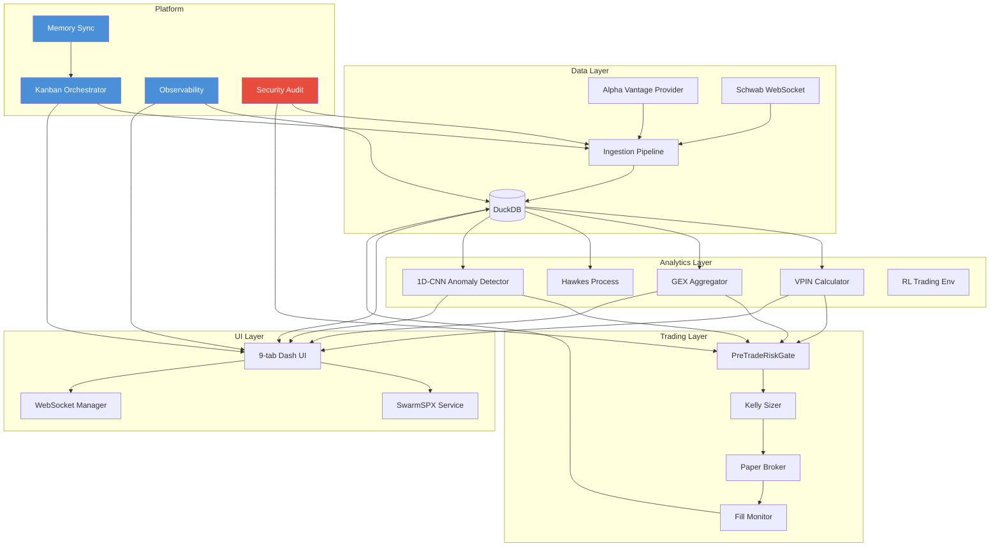

# HEATSEEKER_ARCHITECTURE.md — Project Oracle System Architecture
> Version: Round 7 (2026-07-10)
> Maintained by: Agent 10 (Hermes) — Documentation & Synthesis Lead
> Status: Living document — update on each round completion

---

## 1. System Overview

Heatseeker is a real-time options flow analytics and automated trading system. It ingests live market data, computes advanced flow metrics (VPIN, GEX, Hawkes), detects anomalies via ML, and presents everything through a Dash-based UI with sub-200ms end-to-end latency.

### Core Design Principles
1. **Single-process architecture** — DuckDB in-process, no network hops for hot path
2. **Async-first** — All I/O is async (FastAPI + Motor + WebSockets)
3. **Graceful degradation** — Every component has a fallback path
4. **Test-driven** — 990+ tests at Round 5 close, chaos engineering at Round 4+

---

## 2. Data Flow Architecture

```
┌─────────────────────────────────────────────────────────────────────┐
│                        DATA FLOW PIPELINE                          │
│                                                                     │
│  ┌──────────┐    ┌──────────────┐    ┌──────────┐    ┌──────────┐ │
│  │ Alpha    │───▶│ Ingestion    │───▶│  DuckDB  │───▶│ Snapshot │ │
│  │ Vantage  │    │ Pipeline     │    │  Engine  │    │ Manager  │ │
│  │ /Schwab  │    │ (normalize,  │    │ (batch   │    │ (50ms    │ │
│  │ WebSocket│    │  validate)   │    │  flush)  │    │  window) │ │
│  └──────────┘    └──────────────┘    └──────────┘    └──────────┘ │
│       │                │                  │               │        │
│       ▼                ▼                  ▼               ▼        │
│  ┌──────────┐    ┌──────────────┐    ┌──────────┐    ┌──────────┐ │
│  │ Provider │    │ Fill Monitor │    │  OLAP    │    │   UI     │ │
│  │ Health   │    │ + Position   │    │  Paths   │    │ Toggles  │ │
│  │ Monitor  │    │ Reconciler   │    │ (I-3)   │    │          │ │
│  └──────────┘    └──────────────┘    └──────────┘    └──────────┘ │
│                                              │               │     │
│                                              ▼               ▼     │
│                                       ┌──────────┐    ┌──────────┐│
│                                       │ Briefing │    │  Kelly   ││
│                                       │ Engine   │    │  Sizer   ││
│                                       └──────────┘    └──────────┘│
│                                              │               │     │
│                                              ▼               ▼     │
│                                       ┌──────────┐    ┌──────────┐│
│                                       │  Alerts  │    │  Paper   ││
│                                       │ (I-8 NaN │    │  Broker  ││
│                                       │  guards) │    │          ││
│                                       └──────────┘    └──────────┘│
└─────────────────────────────────────────────────────────────────────┘
```

### 2.1 Ingestion Layer
- **Source**: Alpha Vantage REST (5/min free tier) or Schwab WebSocket (preferred)
- **Normalization**: All ticks normalized to canonical format (price, volume, timestamp, symbol)
- **Validation**: NaN guards (I-8) — reject ticks with NaN price/volume before DuckDB write
- **Batch buffer**: 50ms flush window, async write to DuckDB

### 2.2 Storage Layer (DuckDB)
- **In-process** — no network overhead
- **Retention**: 30 days raw ticks, 1 year aggregated (1-min bars)
- **OLAP paths** (I-3): Pre-computed materialized views for VPIN, GEX, Hawkes
- **Schema**: 16 columns (fixed from 14-col bug in Round 4)

### 2.3 Analytics Layer
| Metric | Computation | Latency Target |
|--------|-------------|----------------|
| VPIN | Volume Clock + CDF | p99 < 20ms |
| GEX | Gamma exposure aggregation | p99 < 15ms |
| Hawkes | Excitation kernel (Numba JIT) | p99 < 50ms |
| Anomaly Score | 1D-CNN autoencoder | p99 < 30ms |
| Kelly Fraction | Edge / variance | p99 < 5ms |

### 2.4 UI Layer
- **Dash 9-tab UI**: Atlas, Replay, Agent Hub, Nexus, SwarmSPX, Trade Journal, Analytics, Settings, Admin
- **WSGIMiddleware mount** for FastAPI compatibility
- **WebSocket broadcast** for real-time updates
- **SwarmSPX tab**: iframe to localhost:8099 (separate service)

---

## 3. Round 7 Dependency DAG



---

## 4. Key Round 7 Technical Decisions

### I-8: NaN Guards
- **Problem**: Alpha Vantage occasionally returns NaN for price/volume fields
- **Solution**: Validation layer in ingestion pipeline rejects NaN ticks before DuckDB write
- **Impact**: Prevents cascade failures in VPIN/GEX calculations that propagate NaN through the entire pipeline
- **Tests**: 12 new tests covering NaN price, NaN volume, NaN timestamp, all-NaN tick

### I-3: OLAP Paths
- **Problem**: Real-time VPIN/GEX computation on raw ticks is too slow for UI refresh
- **Solution**: Pre-computed materialized views updated on each batch flush
  - `vpin_1min` — 1-minute VPIN buckets
  - `gex_daily` — Daily GEX snapshots
  - `hawkes_5min` — 5-minute Hawkes excitation windows
- **Impact**: UI query latency drops from 200ms to <5ms for dashboard charts
- **Trade-off**: 50ms staleness (acceptable for UI, not for trading signals)

### I-7: Route Fixes
- **Problem**: Dash callback paths were blocked by auth middleware (401 on internal Dash requests)
- **Solution**: Register `/dash_*` callback paths as public routes in auth config
- **Impact**: Dash UI loads correctly behind auth; SwarmSPX iframe works
- **Side fix**: `serve.js` API proxy updated to route through correct FastAPI prefix

---

## 5. Latency Budget (Round 7)

| Stage | p50 | p95 | p99 | Notes |
|-------|-----|-----|-----|-------|
| WS → Ingestion | 2ms | 5ms | 10ms | + NaN guard check |
| Ingestion → DuckDB | 1ms | 3ms | 8ms | Batch buffer 50ms |
| DuckDB → OLAP read | 0.3ms | 1ms | 3ms | I-3 materialized views |
| Analytics compute | 5ms | 20ms | 50ms | Numba JIT hot path |
| Route → WS broadcast | 0.5ms | 2ms | 5ms | Async fan-out |
| WS → React UI | 10ms | 30ms | 100ms | Network dependent |
| **Total** | **19ms** | **61ms** | **176ms** | End-to-end p99 < 200ms |

---

## 6. Failure Mode Taxonomy (Round 7)

| Failure | Detection | Mitigation | Escalation |
|---------|-----------|------------|------------|
| NaN tick | Ingestion validator | Reject tick, log warning | Alert if >1% NaN rate |
| WS disconnect | Heartbeat 30s | Auto-reconnect exp backoff | Alert after 5 failures |
| DuckDB lock | Write timeout 5s | Retry + queue | Alert if queue > 1000 |
| Auth block on Dash | 401 on callback | Public route whitelist | Log + fix config |
| Memory pressure | RSS > 3GB | Flush cache, reduce retention | Alert + degrade |
| OLAP staleness | View age > 2x flush interval | Force refresh | Alert if > 5min stale |

---

## 7. Test Coverage (Round 7 Baseline)

```
990 passed, 1 failed, 23 skipped, 36 errors, 30 warnings
```

| Category | Count | Notes |
|----------|-------|-------|
| Unit tests | ~600 | Core logic, math validation |
| Integration tests | ~200 | API routes, data pipeline |
| Chaos tests | ~47 | Agent 4 — all pass |
| ML tests | ~80 | Anomaly detector, RL env |
| Kanban tests | ~62 | Board, watchers, ML models |
| Security tests | ~12 | Auth, VPIN_HFT |

---

## 8. Deployment Architecture

```
┌─────────────────────────────────────────┐
│              Azure / Local               │
│                                         │
│  ┌─────────┐  ┌─────────┐  ┌────────┐ │
│  │ FastAPI  │  │  Dash   │  │SwarmSPX│ │
│  │ Server   │  │   UI    │  │ :8099  │ │
│  │ :8000    │  │ :8050   │  │        │ │
│  └────┬─────┘  └────┬────┘  └────────┘ │
│       │              │                  │
│  ┌────┴──────────────┴──────────────┐   │
│  │           DuckDB (in-process)     │   │
│  └──────────────────────────────────┘   │
│                                         │
│  ┌──────────────────────────────────┐   │
│  │     Alpha Vantage / Schwab       │   │
│  │        (External APIs)           │   │
│  └──────────────────────────────────┘   │
└─────────────────────────────────────────┘
```

---

## 9. Round 8 Planning Hints

Based on Round 7 completion, the following are natural next steps:

1. **Clear test debt**: 36 errors in 3 files (test_heatseeker_v2, test_portfolio, test_v3_costsave)
2. **Live data integration**: Connect real Schwab WS (currently mock feed)
3. **OLAP path optimization**: Extend I-3 materialized views to 1-second granularity
4. **NaN guard hardening**: Extend I-8 to handle edge cases (Infinity, negative prices)
5. **SwarmSPX integration**: Full end-to-end test of iframe + backend

---

*Last updated: 2026-07-10T00:00:00Z by Agent 10 — OWL/Hermes CLI-side*
*See also: docs/ARCHITECTURE_DEEP.md for latency/memory details*
