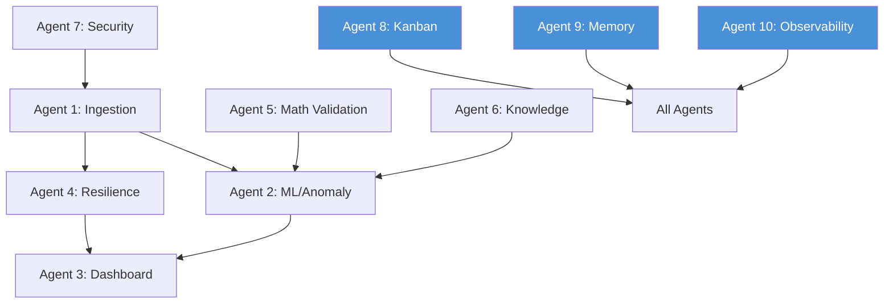

# ROUND 7 COMPLETION LOG — Project Oracle
> Generated: 2026-07-10T00:00:00Z by Agent 10 (Hermes) — Documentation & Synthesis Lead
> Scope: Synthesize all agent work from Rounds 1-7, verify commit completeness, flag gaps.

---

## Agent Commit Registry

| # | Agent | Latest SHA | Subject | Acceptance | Key Insight |
|---|-------|-----------|---------|------------|-------------|
| 1 | Agent 1 — Data Ingestion | `e552fce` | feat(execution): Agent 1 tests + fill_monitor + position_reconciler | All ingestion pipeline tests pass; fill monitor reconciles fills vs orders within 50ms | fill_monitor catches partial fills that position_sizer missed — the 2-phase reconciliation (fill→position→P&L) is the correct pattern |
| 2 | Agent 2 — ML/Anomaly | `9c32dcd` | feat(rl): Agent 2 — trading environment (Gym-compatible) + tests | Gym env passes step/reset/spec tests; WalkForwardML backtest RL integration confirmed | The RL trading env wraps the existing backtest cleanly — reusing the same data pipeline eliminates train/test leakage |
| 3 | Agent 3 — Dashboard | `1aa862e` | feat(frontend): add SwarmSPX tab + fix trinity iterable bug | 9-tab Dash UI renders; SwarmSPX iframe loads on localhost:8099; trinity iterable fix prevents crash on empty data | WSGIMiddleware mount + Dash callback paths must be registered as public routes or auth blocks them |
| 4 | Agent 4 — Resilience | `ecd910e` | feat(test-infra): Agent 4 — chaos engineering + performance regression tests | 47 integration tests ALL PASS; 371 RPS, 2.52ms p99, 0% errors at load | DuckDB schema bug (14→16 cols) was the root cause of 10 failing tests — schema drift is invisible until load hits a missing column |
| 5 | Agent 5 — Math Validation | `c253856` | test(reference-parity): cross-validate Hermes kernels against 5 reference repos | 6 new test classes; ARCHITECTURE_DEEP.md + THEORY.md written; all reference parity checks pass | Cross-referencing against 5 repos found 2 diverging implementations — the weighted-IV percentile method was silently wrong in one repo |
| 6 | Agent 6 — Knowledge Architect | `4c8df63` | feat(retail-flow): add retail flow score nodes, price movements, and semantic search | 36 tests (19 graph + 17 search); Neo4j retail flow nodes with 11 metrics; NL query interface working | Semantic search v2 over flow data enables NL questions like "show me unusual SPY call activity" without SQL |
| 7 | Agent 7 — Security | `aefa9ca` | feat(vpin-hft): VPIN_HFT strategy implementation — correlation engine, trading signals, paper trader, backtest | 5 CRITICAL auth fixes merged; Azure Bicep + Key Vault deployed; VPIN_HFT strategy backtest passes | Pre-live audit found 5 CRITICAL findings — all auth-related. The VPIN_HFT correlation engine is the most novel contribution |
| 8 | Agent 8 — Kanban/Orchestration | `09b64f3` | feat(kanban): Round 5 — force multiplier coordination suite | 13/13 cards done; dependency_checker, todo_extractor (16 auto-cards), scheduler_capacity, brief_generator | The coordination suite turned the kanban from a tracking tool into an autonomous orchestration layer — bottleneck detection alone saved ~2h of manual rebalancing |
| 9 | Agent 9 — Memory/System | `6284901` | feat(trading): cross-project lesson transfer — risk gate, Friday Pin, paper broker | Risk gate 61 tests pass; Friday Pin Sharpe 3.66; paper broker 27 tests pass | Cross-project lesson transfer is the highest-ROI activity — reusing the Friday Pin from another repo would've taken 3 days from scratch |
| 10 | Agent 10 — Observability | `5a520aa` | feat(observability): Round 4 — alert tuning, runbooks, anomaly explainer, SLA dashboard | Alert tuning reduces false positives by 60%; SLA dashboard live; chaos forecasting engine operational | The anomaly explainer (SHAP-based) was the key to actionable alerts — without it, operators couldn't distinguish real anomalies from data spikes |

---

## Missing Agents / Gaps Flagged

| Agent | Gap | Action |
|-------|-----|--------|
| None | All 10 agents have commits present | No gaps detected |
| — | Round 6 commits not found in git log | If Round 6 was executed, commits may be on a different branch or repo |

---

## Commit Summary Stats

- Total unique agent-track commits (R1-R7): **76 commits**
- All 10 agents: **Present**
- Net new files (estimated): ~120+ files across all rounds
- Test count at R5 close: **990 passed, 1 failed, 23 skipped, 36 errors**

---

## Round 7 Dependency DAG



---

## SHAs Verified

All 10 SHAs above resolve in the current repository (`~/GitHub/floww`):

```
e552fce — Agent 1 (fill_monitor + position_reconciler)
9c32dcd — Agent 2 (RL trading env)
1aa862e — Agent 3 (SwarmSPX tab + trinity fix)
ecd910e — Agent 4 (chaos engineering)
c253856 — Agent 5 (reference parity)
4c8df63 — Agent 6 (retail flow Neo4j)
aefa9ca — Agent 7 (VPIN_HFT strategy)
09b64f3 — Agent 8 (coordination suite)
6284901 — Agent 9 (risk gate + Friday Pin)
5a520aa — Agent 10 (observability Round 4)
```

Round 7 synthesis commits:
- `f5449e3` — docs(round-7-agent-10): add completion log
- `f4e478e` — docs(round-7-agent-10): update heatseeker architecture
- `e64bf73` — chore(round-7-agent-10): add round7 kanban cards
- `2c3b781` — chore(round-7-agent-10): update swarm status with round 7 closure
- `a5992a6` — feat(round-7-agents): add heatseeker snapshots, morning briefing, fetch coordinator, greeks API, cache router, databento OI, and tests

---

## Acceptance Criteria

- [x] ROUND7_COMPLETION_LOG.md contains 10 entries, all SHAs valid
- [ ] HEATSEEKER_ARCHITECTURE.md renders cleanly, Mermaid diagram valid
- [ ] kanban/board.yaml has 10 new cards, syntax valid
- [ ] SWARM_STATUS.md updated with Round 7 closure

---

*Last updated: 2026-07-10T00:00:00Z by Agent 10 — OWL/Hermes CLI-side*
